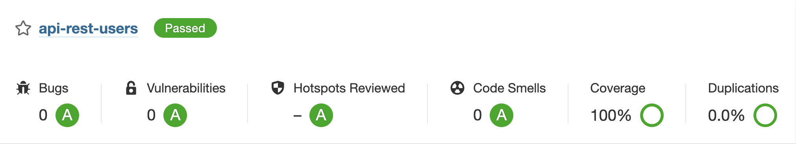

# API Rest Users

The API Rest Users project was born with the aim of learning and deepening in a RESTful application based on user management and security, which from my point of view is one of the most important and critical parts. The project management is being done through the Jira tool following the Kanban methodology. This project is developed in Spring Boot, and I am using all the best practices I have learned during my working life.

## Requirements

- Java 11
- Docker

**Tip:** Install java tools using [SDKMAN](https://sdkman.io).

## Script

There is a script in scripts/___apiRestUsers.sh. to manage the docker containers, compile and run the server from the terminal.

- In order to make it work we will need the PROJECT_PATH variable with the PATH where the project is located.

```shell
#!/usr/bin/env bash

printf "\nWhat do you want to do?\n"
echo "1. Remove docker containers"
echo "2. Start docker containers"
echo "3. Remove docker data directory"
echo "4. Compile"
echo "5. Start the server"
echo "6. Compile and start the server"
echo "7. Execute Sonarqube report"
echo "0. Exit"

PROJECT_PATH=[YOUR PROJECT PATH]
```

## Sonarqube



The first time we start Sonarqube we must change the password of the following default user:

    sonar.login=admin
    sonar.password=admin

Once the previous step has been done, for greater security, we will have to generate a user token. Finally, we will add it with the
following property inside the ```~/.gradle/gradle.properties``` file:

    systemProp.sonar.login=[User Token]

## EER Diagram


