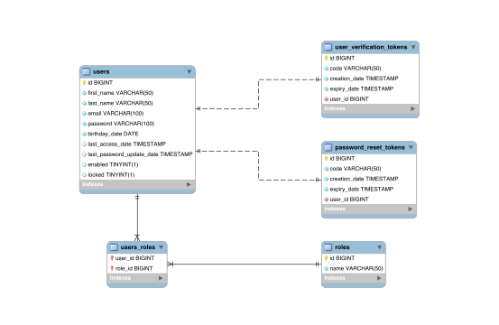

<h1 align="center">API Rest Users</h1>

<p align="center">
    
    
    
</p>

The API Rest Users project was born with the aim of learning and deepening in a RESTful application based on user management and security,
which from my point of view is one of the most important and critical parts. The project management is being done through the Jira tool
following the Kanban methodology. This project is developed in Spring Boot, and I am using all the best practices I have learned during my
working life.

## Requirements

- Java 11
- Docker

**Tip:** Install java tools using [SDKMAN](https://sdkman.io).

## Script

There is a script in scripts/___apiRestUsers.sh. to manage the docker containers, compile and run the server from the terminal.

- In order to make it work we will need the PROJECT_PATH variable with the PATH where the project is located.

```shell
#!/usr/bin/env bash

printf "\nWhat do you want to do?\n"
echo "1. Remove docker containers"
echo "2. Start docker containers"
echo "3. Remove docker data directory"
echo "4. Compile"
echo "5. Start the server"
echo "6. Compile and start the server"
echo "7. Execute JaCoCo test report"
echo "0. Exit"

PROJECT_PATH=[YOUR PROJECT PATH]
```

## EER Diagram


